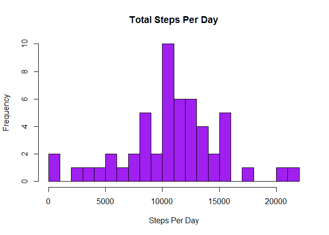
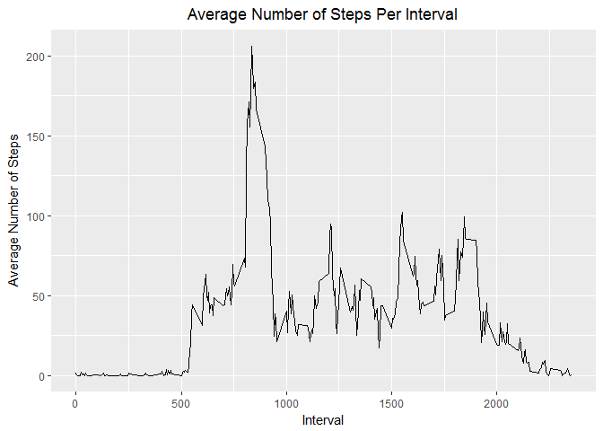
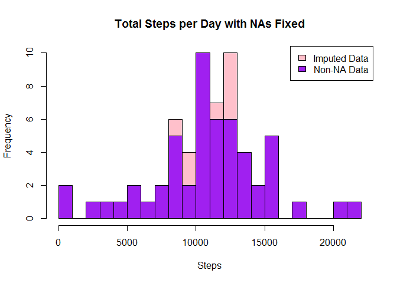
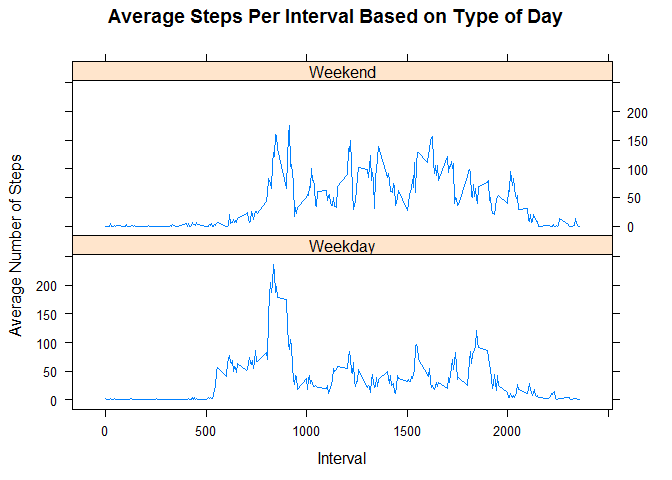

# Reproducible Research: Peer Assessment 1

## Loading and preprocessing the data
Unzip the activity.zip file.

```r
unzip("activity.zip", exdir = "data")
```
Load the data for use and view raw data counts and summary.

```r
activity <- read.csv("data/activity.csv")
dim(activity)
```

```
## [1] 17568     3
```

```r
summary(activity)
```

```
##      steps                date          interval     
##  Min.   :  0.00   2012-10-01:  288   Min.   :   0.0  
##  1st Qu.:  0.00   2012-10-02:  288   1st Qu.: 588.8  
##  Median :  0.00   2012-10-03:  288   Median :1177.5  
##  Mean   : 37.38   2012-10-04:  288   Mean   :1177.5  
##  3rd Qu.: 12.00   2012-10-05:  288   3rd Qu.:1766.2  
##  Max.   :806.00   2012-10-06:  288   Max.   :2355.0  
##  NA's   :2304     (Other)   :15840
```
Convert date field from character to Date and add day field.

```r
activity$date <- as.Date(activity$date)
activity$day <- weekdays(as.Date(activity$date))
```
Remove NA values from Steps data.

```r
cleanData <- activity[!is.na(activity$steps),]
```
View head() of preprocessed and cleaned activity data.

```r
head(cleanData)
```

```
##     steps       date interval     day
## 289     0 2012-10-02        0 Tuesday
## 290     0 2012-10-02        5 Tuesday
## 291     0 2012-10-02       10 Tuesday
## 292     0 2012-10-02       15 Tuesday
## 293     0 2012-10-02       20 Tuesday
## 294     0 2012-10-02       25 Tuesday
```

## What is mean total number of steps taken per day?
####Calculate the total number of steps taken per day and view head()

```r
library(plyr)
```

```
## Warning: package 'plyr' was built under R version 3.4.2
```

```r
stepsByDay <- aggregate(cleanData$steps ~ cleanData$date, FUN=sum)
colnames(stepsByDay)<- c("Date", "Steps")
head(stepsByDay)
```

```
##         Date Steps
## 1 2012-10-02   126
## 2 2012-10-03 11352
## 3 2012-10-04 12116
## 4 2012-10-05 13294
## 5 2012-10-06 15420
## 6 2012-10-07 11015
```
####Plot histogram of Total Steps Per Day

```r
hist(stepsByDay$Steps, breaks = 20, col = "purple", xlab = "Steps Per Day", main = "Total Steps Per Day")
```

<!-- -->

####Calculate and report the mean and median of the total number of steps taken per day

```r
meanSteps <- as.integer(mean(stepsByDay$Steps))
medianSteps <- as.integer(median(stepsByDay$Steps))
```
The mean and median of the total number of steps taken per day are 10766 steps and 10765 steps, respectively.

## What is the average daily activity pattern?
####Make a time series plot of the 5-minute interval and the average number of steps taken

```r
library(ggplot2)
```

```
## Warning: package 'ggplot2' was built under R version 3.4.2
```

```r
intervalTable <- ddply(cleanData, .(interval), summarize, Avg = mean(steps))
plot <- ggplot(intervalTable, aes(x=interval, y=Avg))
plot + geom_line() + xlab("Interval") + ylab("Average Number of Steps") + ggtitle("Average Number of Steps Per Interval") + theme(plot.title = element_text(hjust=.5)) 
```

<!-- -->

####Which 5-minute interval, on average across all the days in the dataset, contains the maximum number of steps?

```r
maxSteps <- max(intervalTable$Avg)
maxInterval <- intervalTable[intervalTable$Avg==maxSteps,1]
```
The maximum number of steps in any given 5-minute interval is 206 and it occurred in the 835th interval.

## Imputing missing values
####Calculate and report the number of missing values in the dataset

```r
##Count NA values
naValues <- nrow(activity[is.na(activity$steps),])
```
The total number of rows with steps = NA is 2304.

####Devise a strategy to fill in missing data

Due to the number of NA values, my strategy for filling in NAs will be to substitute the missing steps with the average 5-minute interval based on the day of the week.

```r
intervalAvg <- ddply(cleanData, .(interval, day), summarize, Avg = mean(steps))
naData <- activity[is.na(activity$steps),]
allData <- merge(naData, intervalAvg, by=c("interval", "day"))
```
####Create new dataset with missing data filled in

```r
##Get allData formatted like cleanData
allData2<- allData[,c(5,4,1,2)]
colnames(allData2)<- c("steps", "date", "interval", "day")
##Merge datasets for complete dataset
mergedData <- rbind(cleanData, allData2)
```
####Make a histogram of the total number of steps taken each day and calculate and report the mean and median total number of steps taken per day

```r
##Calculate sum, mean, and median of complete dataset (with imputed values)
stepsByDay2 <- aggregate(mergedData$steps ~ mergedData$date, FUN=sum)
colnames(stepsByDay2)<- c("Date", "Steps")

meanSteps2 <- as.integer(mean(stepsByDay2$Steps))
medianSteps2 <- as.integer(median(stepsByDay2$Steps))
```
The mean of the total number of steps taken per day with imputed data are 10821, compared to an original mean of 10766. This is a difference of 55. 

The median of the total number of steps taken per day with imputed data are 11015 steps, compared to a median of 10765. This is a difference of 250.


```r
## Create histogram of total steps per day, categorized by data set to show impact
hist(stepsByDay2$Steps, breaks=20, xlab="Steps", main = "Total Steps per Day with NAs Fixed", col="Pink")
hist(stepsByDay$Steps, breaks=20, xlab="Steps", main = "Total Steps per Day with NAs Fixed", col="Purple", add=T)
legend("topright", c("Imputed Data", "Non-NA Data"), fill=c("Pink", "Purple"))
```

<!-- -->

While the mean and median increased slightly with imputed data, the overall shape of the distribution has not changed much. The impact of adding imputed data is low.

## Are there differences in activity patterns between weekdays and weekends?
####Create a new factor variable in the dataset with two levels - “weekday” and “weekend” - indicating whether a given date is a weekday or weekend day

```r
library(lattice)
##Create weekend and weekday categories using merged data
mergedData$dayCategory <- ifelse(mergedData$day %in% c("Saturday", "Sunday"), "Weekend", "Weekday")
##Summarize data by interval and day category
intervalDayCategory <- ddply(mergedData, .(interval, dayCategory), summarize, Avg = mean(steps))
```
####Make a panel plot containing a time series plot of the 5-minute interval and the average number of steps taken, averaged across all weekday days or weekend days

```r
##Create panel plot of the data
xyplot(Avg~interval|dayCategory, data=intervalDayCategory, type="l",  layout = c(1,2),
       main="Average Steps Per Interval Based on Type of Day", 
       ylab="Average Number of Steps", xlab="Interval")
```

<!-- -->

Based on this data, it is evident that this particular individual was more active on weekends vs. weekdays. This is likely due to this person having a sedentary job (i.e. sits at a desk all day) and an increased opportunity for activity during the weekend, while not working.
